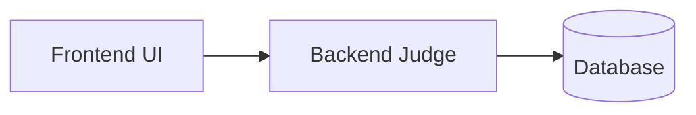
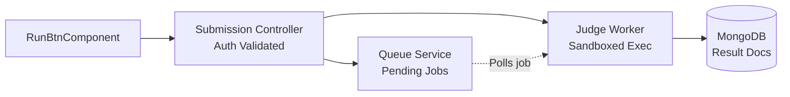

## Prerequisites

Before diving into Low-Level Design (LLD), engineers should have a solid grasp of **Object-Oriented Programming (OOP)** concepts. Understanding abstraction, encapsulation, inheritance, and the proper use of constructors is vital for structuring components effectively.

## What is LLD?

LLD is where your code starts to take shape. It's the bridge between the architecture and actual implementation.

### The Real-Life Analogy: Building a Home

*   **High-Level Design (HLD):** You are buying a 3BHK flat. You specify the layout: 3 rooms, 1 hall, and 1 kitchen. You map out how these areas connect to one another.
*   **Low-Level Design (LLD):** This is the interior blueprint. What exactly goes inside the first room? Where is the bed placed? What type of electrical wiring is used in the kitchen? LLD details the granular specifics of every single room.

### Coding Characteristics of LLD

*   **Granular Code Level:** Defines exactly what a class, interface, or module does.
*   **Implementation Focused:** Details what functions exist, their input parameters, return types, and what each function accomplishes.
*   **Applies OOP Principles:** Ensures code is modular, reusable, and secure by enforcing rules like abstraction and encapsulation.

**Example: Authentication Module**
If we need to maintain authentication, the LLD will define the specific classes needed: `LoginManager`, `SignupService`, and `PasswordRecovery`. It will define the constructors for these classes, the dependency injection required, and the exact methods (e.g., `verifyCredentials(user, pass)`) they expose.

## System View: HLD vs. LLD

To understand the difference, let's look at a Code Judge system where a user clicks a **Run/Submit** button.

### 1. The High-Level Design (HLD)

In HLD, we treat entire applications as black boxes. We only care about how data flows from the user to the database.

*Figure 1: High-Level flow of a Code Submission*

### 2. The Low-Level Design (LLD)

In LLD, we zoom into the system. For every high-level box, there are smaller, granular components. We define the controllers, the message queues, the worker services, and the specific database document structures.

*Figure 2: Low-Level Component flow of a Code Submission*

*Notice how the LLD breaks down the generic "Backend" into a specific Submission Controller, an async Queue, and a Judge Worker that eventually stores the execution document in MongoDB.*

## Stakeholders in LLD

*   **SDE-3 / Managers:** Drive the architectural vision (HLD) and review the critical paths of the LLD to ensure it meets scale and security requirements.
*   **SDE-2:** Heavily involved in writing the LLD. They define the class structures, API contracts, and database schemas.
*   **SDE-1 (Freshers):** Implement the core functionality based on the LLD document. A well-written LLD provides clear instructions on what functions to write and how classes should interact, removing ambiguity.

## Why is LLD Important?

*   **Avoids Re-work:** By planning class structures and data models beforehand, developers avoid coding themselves into a corner.
*   **Improves Collaboration:** Multiple engineers can work on different classes simultaneously because the interfaces and expected behaviors are already defined.
*   **Promotes Scalability:** Well-designed components (using design patterns) are easier to extend or replace as the system grows.
*   **Encourages Best Practices:** Forces engineers to think about SOLID principles, proper encapsulation, and modularity before writing a single line of code.